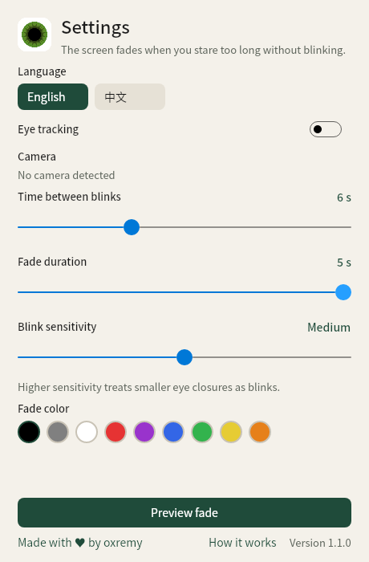
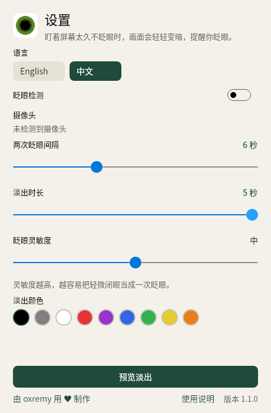

# BlinkMore for Windows

托盘程序。盯着屏幕太久不眨眼时，画面会变暗；眨一下眼就恢复。可以在 English 和中文之间切换。

macOS 版仍在仓库根目录的 `BlinkMore/` 里。这里是 Windows 移植，用 .NET 8 和 Avalonia 写成，眨眼检测使用 OpenCV。

## 直接运行

需要 64 位 Windows 10 或 Windows 11。不需要另外安装 .NET。

1. 下载仓库根目录的 `BlinkMore-Windows-x64.zip`
2. 解压
3. 运行 `BlinkMore.exe`
4. 在任务栏右下角的托盘图标上点右键

第一次打开会询问是否使用摄像头。可以先跳过，之后在设置里再打开。

语言在两个地方切换，效果一样：

- 托盘菜单里的「语言」
- 设置窗口顶部的 English / 中文

## 从源码编译

安装 [.NET 8 SDK](https://dotnet.microsoft.com/download/dotnet/8.0) 或更新的 SDK。

```bash
./windows/build.sh
```

Windows 上：

```powershell
./windows/build.ps1
```

产物是 `dist/BlinkMore-Windows/BlinkMore.exe`（单个自包含 exe），并打包成仓库根目录的 `BlinkMore-Windows-x64.zip`。解压后还有使用说明和许可证。

只跑测试：

```bash
dotnet test windows/BlinkMore.sln -c Release
```

界面自测（需要图形环境；Linux 上用 Xvfb）：

```bash
./windows/self-test.sh
```

## 它做什么

和 macOS 版一样：

- 开启或关闭眨眼检测
- 两次眨眼间隔：3 到 12 秒
- 淡出时长：1 到 5 秒
- 眨眼灵敏度：低 / 中 / 高
- 九种淡出颜色
- 选择摄像头
- 画面持续变暗 6 秒后，检测会自动关闭，避免一直挡住屏幕

画面只在这台电脑上处理，不会上传，也不会保存。

## English

BlinkMore for Windows is a tray app. The screen fades when you stare too long without blinking, and a blink brings it back. Switch language from the tray menu or the top of the settings window.

The macOS app in `BlinkMore/` is unchanged. This folder is the Windows port.

Unzip `BlinkMore-Windows-x64.zip` in the repository root and run `BlinkMore.exe`. No separate .NET install is required. To build from source, install the .NET 8 SDK and run `./windows/build.sh` or `windows/build.ps1`.




